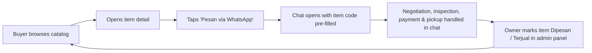
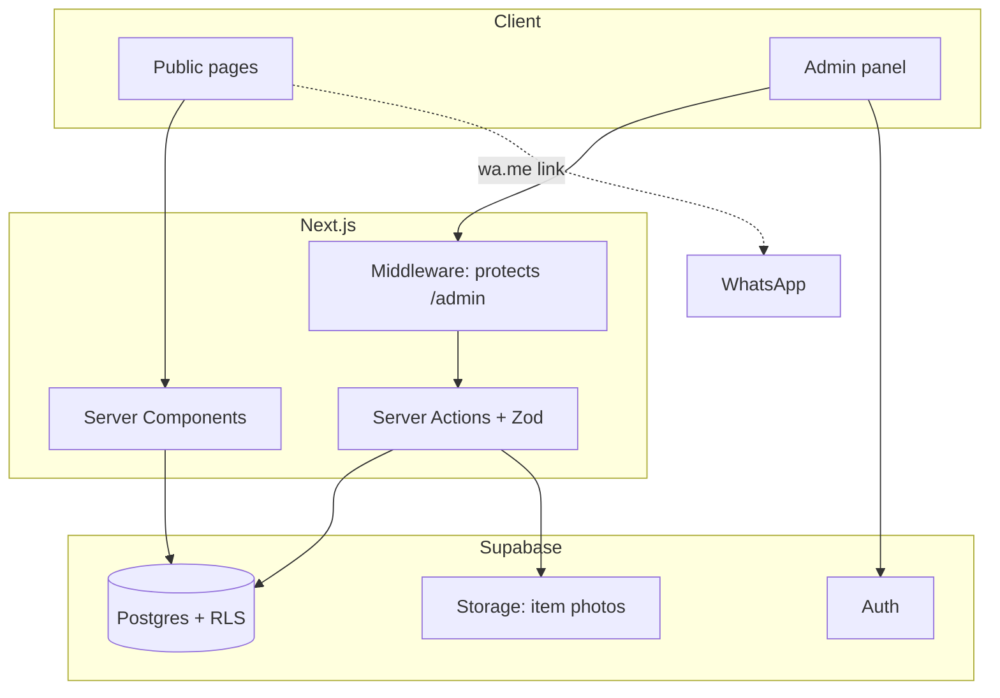

# SisaBangun

_A catalog website for used construction materials from a family contracting business — browse items, then order via WhatsApp. Built daily as a full-stack + web-operations learning project._


> ℹ️ **Note:** This repository contains code, database schema, and dummy seed data only. No real customer data, client information, or production secrets are stored here.

---

## Why this project

My father is a contractor, and over the years his projects have left behind a lot of reusable materials — steel, timber, frames, tiles — that he can only sell to the handful of buyers he knows personally. He has wanted a website for this for a long time.

I'm a Data Science & AI student interning as a web developer, working mainly in Go. This project lets me learn the stack much of the web industry uses today (TypeScript, React/Next.js, Postgres) _and_ the parts coursework rarely covers: hosting, security, backups, monitoring, and handing a tool over to a non-technical user. It's built in daily increments over ~8 weeks; see [`docs/journal.md`](docs/journal.md) for the weekly log and [`LEARNING_MAP.md`](LEARNING_MAP.md) for the day-by-day plan.

## What it does

1. **Public catalog** — browse used materials by category, search, and view photos, condition, quantity, pickup location, and price (or "Nego").
2. **WhatsApp checkout** — each item has a "Pesan via WhatsApp" button that opens a chat with a pre-filled message containing the item code and link.
3. **Admin panel** — a mobile-friendly dashboard where the owner adds items, uploads photos, and changes status (Tersedia / Dipesan / Terjual).
4. **Security by default** — Postgres Row Level Security, admin-only writes, no public sign-ups, security headers, secret scanning.
5. **Operations** — CI on every push, automated dependency updates, scheduled backups, uptime monitoring, and a runbook.

## Business flow



Why WhatsApp instead of a cart + payment gateway: used construction materials are usually negotiated, often inspected in person, and need custom pickup arrangements. A chat-based flow matches how these deals actually happen, and keeps v1 small. Online payment is a possible later addition, not a starting requirement.

## Tech stack

`TypeScript` · `Next.js (App Router)` · `React` · `Tailwind CSS` · `Supabase (Postgres, Auth, Storage)` · `Zod` · `Vitest` · `Playwright` · `GitHub Actions`

## Architecture



## Project structure

```
sisabangun/
├── src/
│   ├── app/
│   │   ├── (public)/        # catalog & item detail pages
│   │   └── admin/           # protected admin panel
│   ├── components/          # UI components
│   ├── lib/                 # Supabase clients, WhatsApp link builder, utils
│   ├── types/               # shared & generated DB types
│   └── middleware.ts        # auth guard for /admin
├── supabase/
│   ├── migrations/          # schema + RLS policies (source of truth)
│   └── seed.sql             # dummy data for local development
├── tests/
│   ├── unit/                # Vitest
│   └── e2e/                 # Playwright
├── docs/                    # journal, security, runbook, admin guide, retrospective
├── .github/workflows/       # CI
├── .env.example
├── LEARNING_MAP.md          # the 8-week day-by-day plan this repo follows
└── README.md
```

## Getting started

Requirements: Node.js 20+, pnpm, Docker (for the local Supabase stack), Supabase CLI.

```bash
git clone https://github.com/<your-username>/sisabangun.git
cd sisabangun
pnpm install

# environment variables
cp .env.example .env.local          # then fill in the values

# local database (runs Supabase in Docker, applies migrations + seed)
supabase start
supabase db reset

# dev server
pnpm dev                            # http://localhost:3000
```

### Environment variables

| Variable                        | Exposed to browser? | Description                                                        |
| ------------------------------- | ------------------- | ------------------------------------------------------------------ |
| `NEXT_PUBLIC_SUPABASE_URL`      | Yes                 | Supabase project URL                                               |
| `NEXT_PUBLIC_SUPABASE_ANON_KEY` | Yes                 | Public (anon/publishable) key — safe _only_ because RLS is enabled |
| `SUPABASE_SERVICE_ROLE_KEY`     | **Never**           | Server-only; bypasses RLS. Avoid using it at all if possible       |
| `NEXT_PUBLIC_WA_NUMBER`         | Yes                 | WhatsApp number in international format, e.g. `628xxxxxxxxxx`      |
| `NEXT_PUBLIC_SITE_URL`          | Yes                 | Canonical site URL, used for links and Open Graph images           |

### Scripts

```bash
pnpm dev          # start dev server
pnpm lint         # ESLint
pnpm typecheck    # tsc --noEmit
pnpm test         # Vitest unit tests
pnpm test:e2e     # Playwright end-to-end tests
pnpm build        # production build
```

## Security notes

- **Row Level Security is enabled on every table.** The public key can only read listed items; all writes require the authenticated admin. Verification steps are in [`docs/security.md`](docs/security.md).
- **Public sign-ups are disabled.** Admin accounts are created manually.
- **Secrets never enter the repo.** `.env*` files are git-ignored, GitHub secret scanning and push protection are on, and keys are rotated quarterly.
- **Backups are stored privately**, never in this repository or in public CI artifacts.

## Deployment

- **Preview / development:** Vercel Hobby, auto-deployed from every push.
- **Production:** a hosting plan that permits commercial use, with separate dev and prod Supabase projects. Details in [`docs/runbook.md`](docs/runbook.md).

## Progress

- [ ] Week 1–2 — Discovery, foundations & static catalog
- [ ] Week 3 — Database & RLS (`v0.1-public-catalog`)
- [ ] Week 4–5 — Admin panel, photos & usability test (`v0.2-admin`)
- [ ] Week 6 — Testing, CI & security hardening
- [ ] Week 7–8 — Go-live, operations & handover (`v1.0`)

## Lessons learned

_(populated from `docs/journal.md` and `docs/final_review.md` at the end of the 8 weeks)_

## License

Code is MIT — see [LICENSE](LICENSE). Business name, logo, and product photos are not covered by the license.
