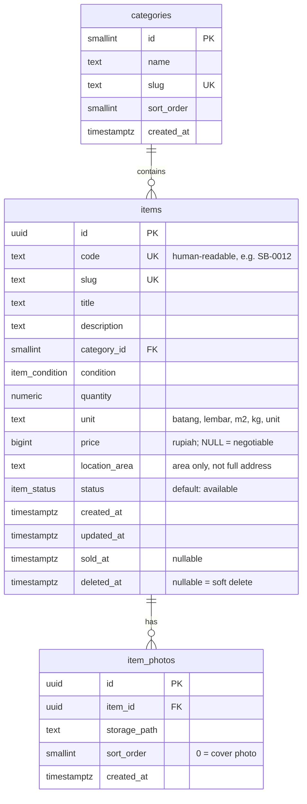

# Data Model (draft)

## ER diagram

## Enums
- `item_status`: `available`, `reserved`, `sold`
- `item_condition`: `good`, `usable`, `needs_repair`

## Design decisions
| Decision | Reason |
|---|---|
| `price` is `bigint` rupiah, not float | Money must be exact; floats cause rounding errors |
| `price` NULL means "Nego" | Avoids a separate boolean that could contradict the price |
| Separate `code` besides `uuid` | UUIDs are unreadable in WhatsApp chats; `SB-0012` is easy to say and search |
| `quantity` is `numeric` + `unit` | Materials come in fractional amounts (2.5 m³) and mixed units |
| `location_area` instead of full address | Privacy: client project addresses are not published |
| Soft delete via `deleted_at` | Accidental deletes are recoverable; history stays intact |
| Photos store `storage_path`, not full URL | URLs change if the bucket or domain changes; paths don't |
| `item_photos.item_id` uses `ON DELETE CASCADE` | No orphaned photo rows |
| No `users` / `buyers` table | Admin lives in Supabase Auth; buyers have no accounts in v1 |

## Deferred (not in v1)
- Partial sales history (pending owner's answer)
- `inquiries` table for WhatsApp-click tracking (stretch goal)