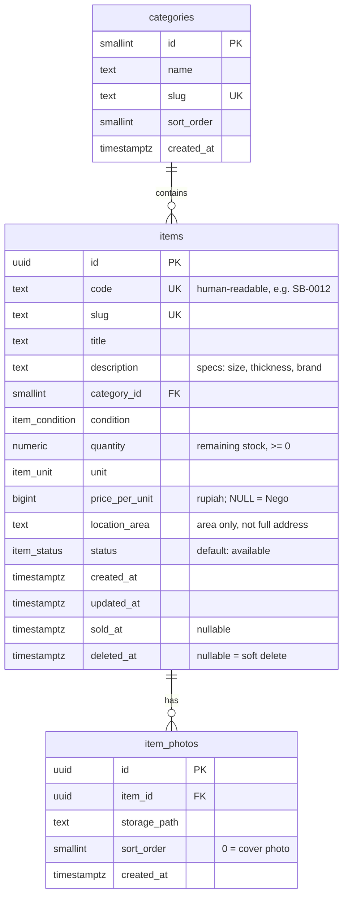

# Data Model (draft)

Based on [`requirements.md`](requirements.md) and [`flows.md`](flows.md).

## ER diagram

## Seed categories

| sort_order | name                   | slug               | Examples                             |
| ---------- | ---------------------- | ------------------ | ------------------------------------ |
| 1          | Andang & Perancah      | `andang-perancah`  | Andang besi, main frame, cross brace |
| 2          | Mesin & Alat Kerja     | `mesin-alat-kerja` | Mesin molen                          |
| 3          | Pipa & Plumbing        | `pipa-plumbing`    | Pipa PVC, fitting                    |
| 4          | Engsel & Hardware      | `engsel-hardware`  | Engsel, kunci, baut                  |
| 5          | Bahan Bangunan Lainnya | `bahan-lainnya`    | Everything else                      |

## Enums

| Enum             | Values                           | UI label                            |
| ---------------- | -------------------------------- | ----------------------------------- |
| `item_status`    | `available`, `reserved`, `sold`  | Tersedia, Dipesan, Terjual          |
| `item_condition` | `good`, `usable`, `needs_repair` | Bagus, Layak pakai, Perlu perbaikan |
| `item_unit`      | `buah`, `m2`, `meter`, `lonjor`  | buah, m², meter, lonjor             |

## Design decisions

| Decision                                        | Reason                                                                                                   |
| ----------------------------------------------- | -------------------------------------------------------------------------------------------------------- |
| `price_per_unit` (not a total price)            | Partial purchase is allowed, so the price must scale with quantity                                       |
| `price_per_unit` NULL means "Nego"              | All prices are negotiable anyway; NULL avoids a separate boolean that could contradict the price         |
| `price_per_unit` is `bigint` rupiah, not float  | Money must be exact                                                                                      |
| `quantity` is `numeric`, not integer            | `m²` and `meter` can be fractional (e.g. 12.5 m²)                                                        |
| `quantity` = **remaining** stock                | Partial sales simply lower it; no sales ledger needed in v1                                              |
| `unit` is an enum, not free text                | Prevents "m2", "M2", "meter persegi" drifting apart; new units are added with `ALTER TYPE ... ADD VALUE` |
| Separate `code` besides `uuid`                  | UUIDs are unreadable in WhatsApp chats; `SB-0012` is easy to say and search                              |
| `location_area` instead of full address         | Privacy: client project addresses are not published                                                      |
| Soft delete via `deleted_at`                    | Accidental deletes are recoverable                                                                       |
| Photos store `storage_path`, not full URL       | Paths survive bucket/domain changes                                                                      |
| `item_photos.item_id` uses `ON DELETE CASCADE`  | No orphaned photo rows                                                                                   |
| No `users` / `buyers` table                     | Admin lives in Supabase Auth; buyers have no accounts                                                    |
| WhatsApp numbers are **config**, not table data | Only two fixed numbers (primary + backup); env vars are enough                                           |

## Constraints to enforce in the migration (Day 13)

- `quantity >= 0`
- `price_per_unit IS NULL OR price_per_unit > 0`
- When `quantity` becomes 0 → set `status = 'sold'` and `sold_at = now()` (trigger)

## Deferred (not in v1)

- `item_sales` ledger (who bought how much, at what negotiated price) — useful for reporting later
- Bulk (borongan) pricing — pending owner's answer
- `inquiries` table for WhatsApp-click tracking (stretch goal)
