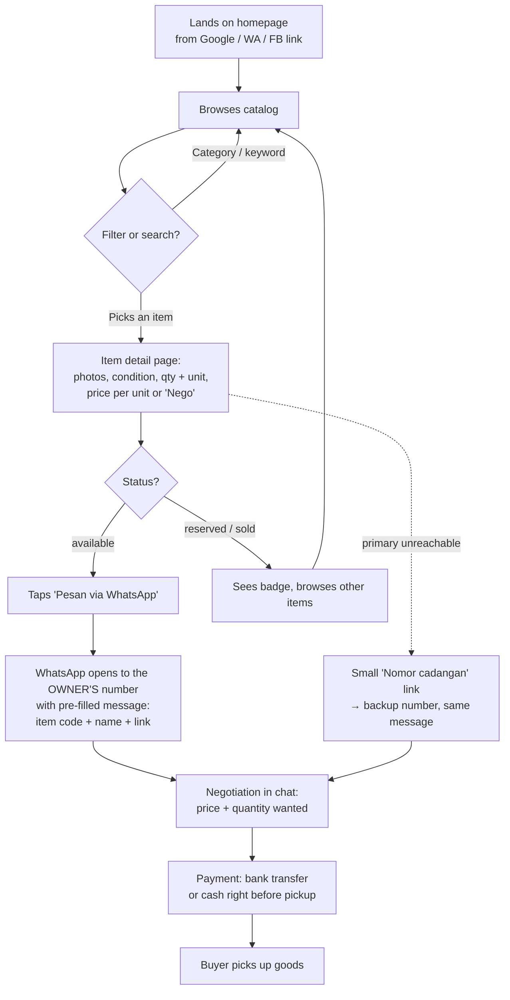
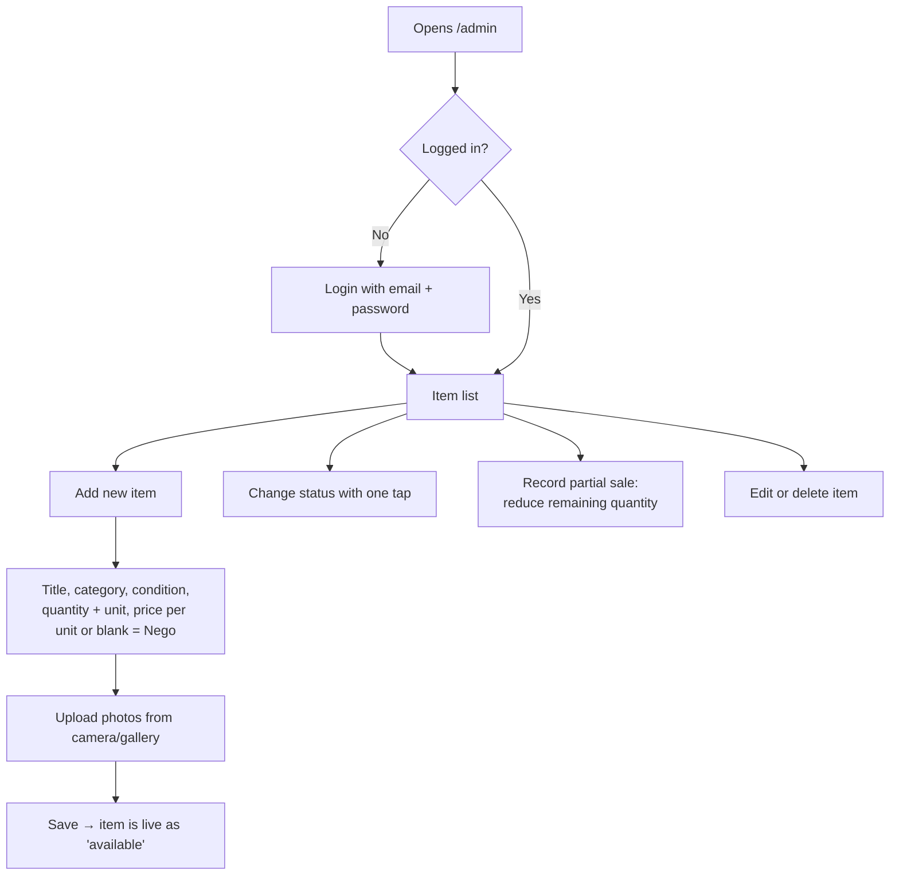
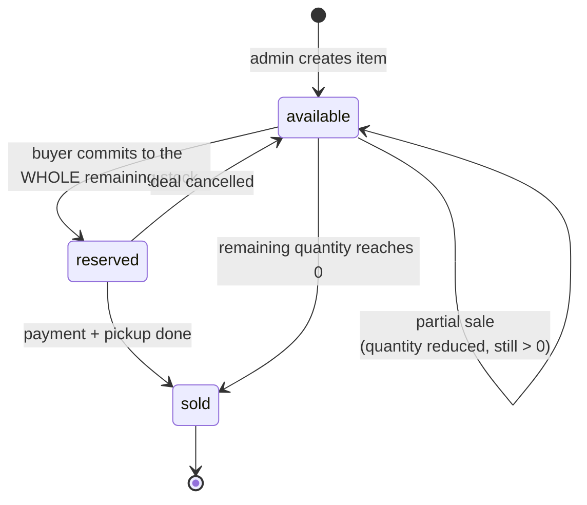

# User Flows

Based on [`requirements.md`](requirements.md).

## 1. Buyer flow

**Notes**

- Buyers never create an account; the site never handles money in v1.
- The pre-filled message lets the buyer state the quantity they want, since partial purchase is allowed.
- The backup number is deliberately less prominent so chats go to the owner first.
- Payment methods are shown as static info on the detail page (transfer / tunai saat ambil).

## 2. Admin flow (owner, on a phone)

## 3. Item status lifecycle (with partial sales)

**Rules**

- A partial sale only lowers `quantity`; the item stays `available`.
- `reserved` is used only when a buyer commits to everything that is left.
- When `quantity` reaches 0 the item becomes `sold` (enforced in the database later).

## 4. Open questions

See [`requirements.md`](requirements.md#open-questions).
