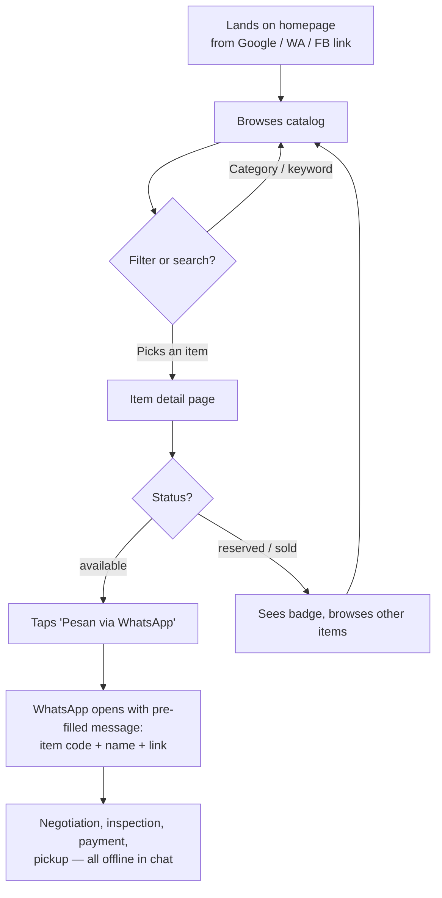
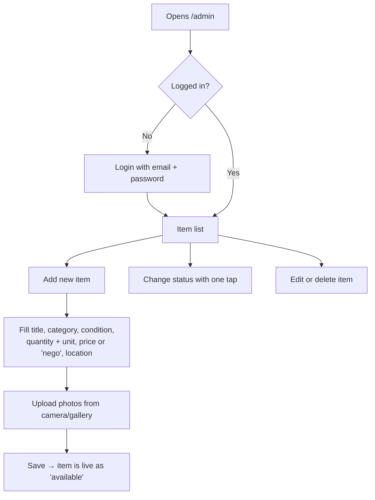
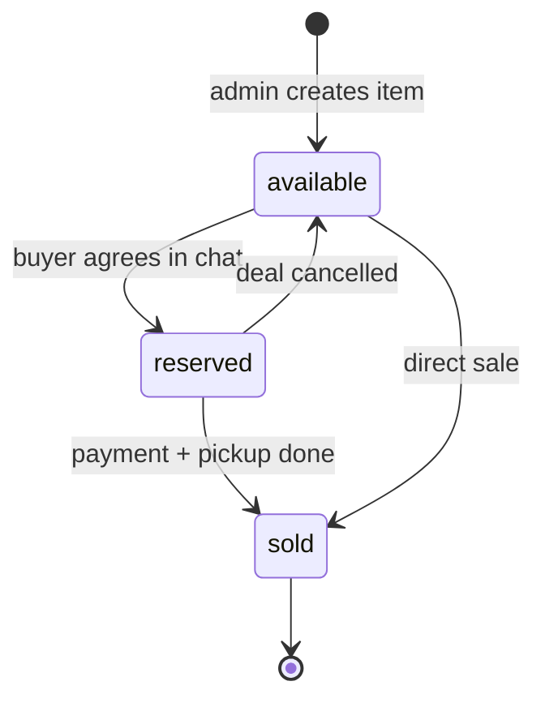

# User Flows

## 1. Buyer flow

**Notes**
- Buyers never create an account.
- The site never handles money in v1.
- Sold items stay visible (greyed out) for a while as social proof, then are hidden.

## 2. Admin flow (owner, on a phone)

## 3. Item status lifecycle

## 4. Open questions for the owner
- [ ] Can an item be sold partially (e.g. 10 of 50 steel bars)?
- [ ] How long should sold items stay visible?
- [ ] Is there more than one person who will update listings?